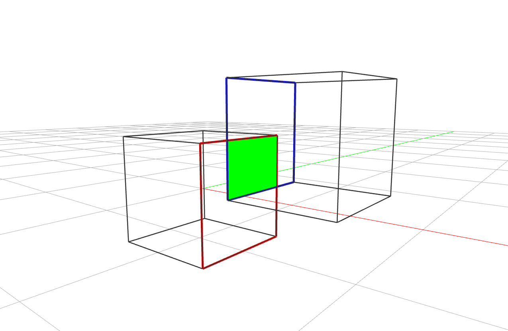

# Brep Overlap

`overlap` reports which faces of two Breps coincide (outlined red and blue), and
`overlap_intersection` returns the actual common region between them (the green face).



```python
---8<--- "docs/examples/breps/brep_overlap.py"
```
