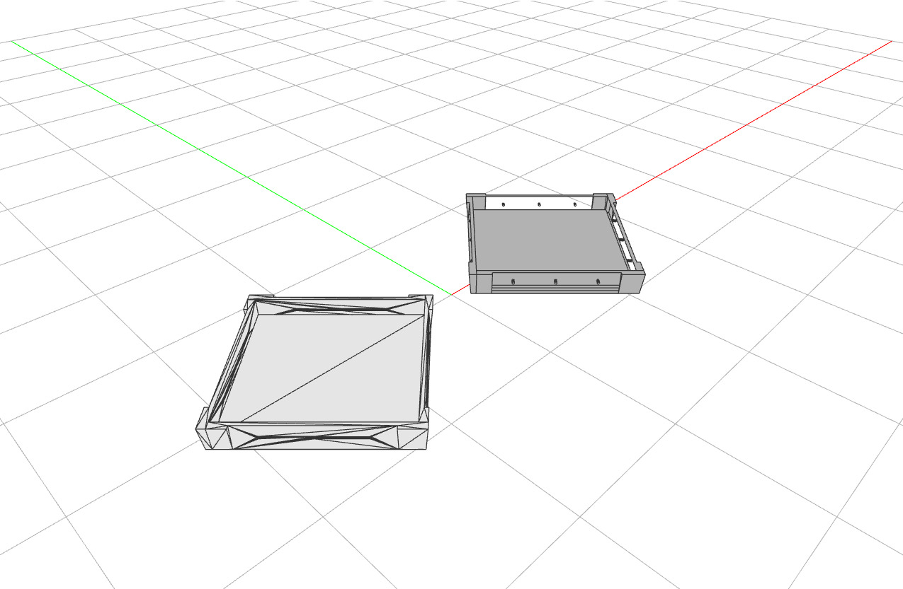

# Merge Coplanar Faces

Convert a triangulated solid mesh into a Brep with clean flat faces by grouping coplanar mesh
faces and rebuilding one polygon per region. The triangulated input (left, 568 triangles)
becomes a Brep with merged planar faces (right, 178 faces).



```python
---8<--- "docs/examples/breps/brep_simplify.py"
```
