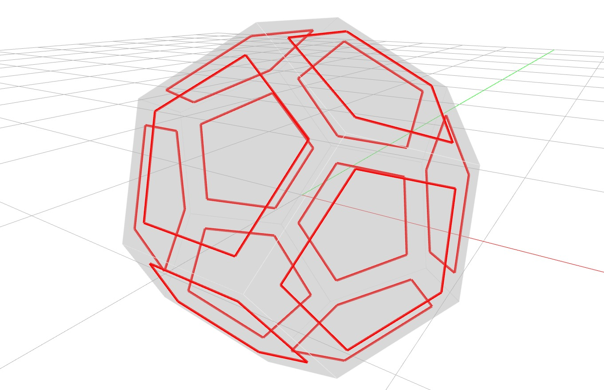

# Brep To Polylines

A Brep whose faces are all flat polygons is fully described by the points of its loops, so
`to_polylines` reduces it to one closed polyline per face loop with nothing lost. Here the twelve
pentagons of a dodecahedron (grey) are each pulled in towards their own centre (red), so that the
boundary of every individual face becomes visible.



```python
---8<--- "docs/examples/breps/brep_to_polylines.py"
```
