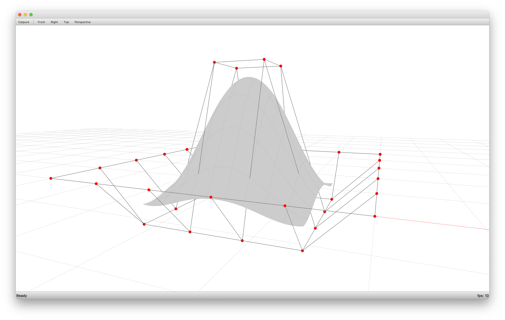

# COMPAS OCCT

COMPAS OCCT provides direct, lean nanobind bindings to the OCCT 8 geometry kernel
of [Open CasCade](https://www.opencascade.com/open-cascade-technology/).
The backend is a single compiled extension module, with no dependency on `pythonocc-core`.

`compas_occt.geometry` defines `compas_occt.geometry.Curve`, `compas_occt.geometry.NurbsCurve`, `compas_occt.geometry.Surface` and `compas_occt.geometry.NurbsSurface`, which are wrappers around `Geom_Curve`, `Geom_BSplineCurve`, `Geom_Surface` and `Geom_BSplineSurface` of OCC, repsectively.

The `compas_occt` wrappers provide an API for working with NURBS curves and surfaces similar to the API of RhinoCommon.
`compas_occt.brep` is a package for working with Boundary Representation (Brep) objects with the NURBS curves and surfaces of `compas_occt.geometry` as underlying geometry.
